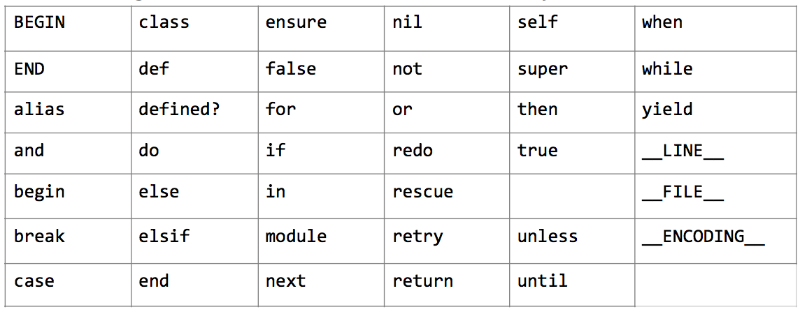

**A1:** (a)および(b)

Rubyではすべてのオブェクトが条件分岐で使用するための論理値を持ちます。

`false`と`nil`は論理的に偽として、それ以外のすべてのオブジェクトは論理的に真として扱われます。

---------------------------------------------------------------------------

**A2:** (c)および(e)

Ruby 3.1の予約語の一覧は以下のとおりです。



---------------------------------------------------------------------------

**A3:** (c)

Rubyのローカル変数名は小文字またはアンダースコアではじまり、アルファベット、数字、アンダースコア、非ASCII文字のみからなります。

予約語を変数名として使用することはできません(例えば`class`という変数名は使用できません)が、予約語を含む変数名は許可されています(つまり`classy`や`_class`は有効な変数名です)。

---------------------------------------------------------------------------

**A4:** (a)および(b)

シングルクォートの文字列リテラルはシンプルで、文字のそのままの列を表現します。

ダブルクォートの文字列リテラルはより複雑ですが、Rubyの式の評価結果を文字列中に埋め込む式展開(`#{...}`)のような機能を提供します。

グローバル変数の値を埋め込む場合は`#$`を省略記法として使用できます(同様にインスタンス変数の場合は`#@`を使用できます)。この省略記法はより一般的な`#{...}`記法に比べるとあまり使われていません。

---------------------------------------------------------------------------

**A5:** (c)

整数リテラルの先頭の0は8進数表記を意味します。ただし、デフォルトでは10進数として出力が行われます。

10進数以外での出力を行うためには、さまざまな書式化数値出力機能が提供されています(例: `Strign#%`、`Numeric#to_s(base)`、`Kernel#printf`)。

---------------------------------------------------------------------------

**A6:** (b)

三項演算子(`cond ? expr1 : expr2`)は`if/else`の省略形で、`cond`が真の場合`expr1`を、偽の場合`expr2`を返します。1行に収まるような短い文の記述に向いています。

---------------------------------------------------------------------------

**A7:** (a)

`case`文は`when`の条件にマッチする最初の分岐を実行します。

Rubyの範囲リテラル`x..y`は、`y`の値を含みます。

したがって、`1..120`と`120..170`の両方が`120`を含み、`when 1..120`の分岐が最初にマッチして実行されます。

---------------------------------------------------------------------------

**A8:** (d)

ブロックでは外側のスコープのローカル変数にアクセスすることができますが、ブロックパラメータ自体は常にブロックローカルです。これはブロックパラメータの名前が外側のローカル変数と同じ場合、ブロック内ではブロックローカル変数が参照されることを意味します。これによって、変数名が衝突した場合に外側のローカル変数を誤って変更することが防がれます。

外側のローカル変数と同名のブロックパラメータを定義することはアンチパターンと考えられ、プログラムの間違いのサインかもしれません。この問題を発見するには、`ruby`を`-w`オプション付きで実行し、`warning: shadowing outer local variable - item`のような警告を表示させるようにします。

---------------------------------------------------------------------------

**A9:** (c)

`Integer#times`メソッドは0から指定された値より1つ小さい整数までの値を順番にブロックパラメータとして渡します。

ブロックパラメータと同名の外側のローカル変数は参照できません(A8参照)が、他のローカル変数はアクセス・変更できます。これはRubyのブロックはクロージャであるためです。

---------------------------------------------------------------------------

**A10:** (d)

[String#each_char](https://docs.ruby-lang.org/ja/3.1/class/String.html#I_EACH_CHAR)はレシーバのそれぞれの文字をyieldする[Enumerator](https://docs.ruby-lang.org/en/3.1/Enumerator.html)を返します。文字は1文字のも文字列で表現されることに注意してください。

[Enumerable#map](https://docs.ruby-lang.org/ja/3.1/class/Enumerable.html#I_MAP) は与えられたブロックの値の配列を返します。

`string * integer`は`string`を`integer`回コピーして連結した値を返します。

したがって、`s.each_char.map { |i| i * 2}`の評価結果は`["aa", "bb", "cc", "dd", "ee"]`になります。

---------------------------------------------------------------------------

**A11:** (c)

[String#chars](https://docs.ruby-lang.org/ja/3.1/class/String.html#I_CHARS)はレシーバのすべての文字の配列を返します。文字は1文字のも文字列で表現されることに注意してください。

[Enumerable#tally](https://docs.ruby-lang.org/ja/3.1/class/Enumerable.html#I_TALLY)は値が同じ要素の数を含むハッシュを返します。

したがって、`"cocoa".chars.tally`の評価結果は`{"c"=>2, "o"=>2, "a"=>1}`になります。

---------------------------------------------------------------------------

**A12:** (b)

[String#gsub](https://docs.ruby-lang.org/ja/3.1/class/String.html#I_GSUB)はパターンにマッチするすべての部分を置換した文字列を返します。


[String#sub](https://docs.ruby-lang.org/ja/3.1/class/String.html#I_SUB)はパターンにマッチする最初の部分を置換した文字列を返します。

[String#replace](https://docs.ruby-lang.org/ja/3.1/class/String.html#I_REPLACE) は与えられた文字列でレシーバの内容を置き換えます。

Stringに`#replace_all`メソッドはありません。

---------------------------------------------------------------------------

**A13:** (b)

`if/elsif/else`文では、最初に条件を満たした`if`または`elsif`の分岐が実行されます。いずれも条件を満たさない場合は、`else`の分岐が実行されます。

---------------------------------------------------------------------------

**A14:** (b)

[String#slice](https://docs.ruby-lang.org/ja/3.1/class/String.html#I_SLICE)は最初にマッチした部分文字列を返します。マッチしなかった場合は`nil`を返します。
`x&.foo`は`x`が`nil`でない場合`x`に対して`foo`メソッドを呼び出します。`x`が`nil`の場合、`x&.foo`はメソッドを呼び出さず、`nil`を返します。

---------------------------------------------------------------------------

**A15: (b)**

キーワード引数が与えられなかった場合、メソッド定義のデフォルト値が使用されます。

---------------------------------------------------------------------------

**A16: (b)**

`**` はHashをキーワード引数に変換します。

---------------------------------------------------------------------------

**A17: (a)および(c)**

文字クラス(`[...]`)はブラケット内のいずれかの文字にマッチします。

選択(`...|...`)は複数の部分式のいずれかにマッチします。

`\A`アンカーは文字列の先頭に、`\z`アンカーは文字列の末尾にマッチします。

(b)が正解でないのは、(b)の部分式は`\ARuby`と`ruby\z`であり、`Ruby123`のような文字列にもマッチしてしまうためです。

---------------------------------------------------------------------------

**A18: (d)**

定数は再定義できますが、通常あまり好ましくないため、警告が表示されます。

Rubyでは定数はモジュールやクラスの名前にも使用されるため、定数の再定義に関する警告は意図しない名前の衝突を防ぐために有用です。

---------------------------------------------------------------------------

**A19: (b)**

定数は再定義されず、定数から参照されるオブジェクトの内容が変更されているだけなので、警告は表示されません。

慣習的に定数から参照されるオブジェクトは変更されないものとして扱われますが、その慣習があてはまらないレアケースもあります。

---------------------------------------------------------------------------

**A20: (b)および(e)**

Rubyの変数名についてのルールは以下のとおりです。

- グローバル変数は`$`ではじまります。
- クラス変数は`@@`ではじまります。
- インスタンス変数は`@`ではじまります。
- ローカル変数は小文字またはアンダースコアではじまります。
- 残りの文字はアルファベット、数字、アンダースコア、非ASCII文字に限定されます。

---------------------------------------------------------------------------

**A21: (c)** 

この例では、`x`と`y`は両方とも同じ配列オブジェクトを参照します。

`Array#reject!`はレシーバを変更するため、両方の変数から参照される一つの配列が変更が変更されるということを意味します。

---------------------------------------------------------------------------

**A22: (c)**

以下のような配列操作があります。

- `shift`は配列の最初の要素を削除し、その要素を返します。
- `pop`は配列の最後の要素を削除し、その要素を返します。
- `push`は配列の末尾に指定された要素を追加します。

---------------------------------------------------------------------------

**A23: (b)**

論理演算子`||`と`&&`は短絡評価され、必要な場合だけ右辺が評価されます。

真理値オブジェクトのために`|`と`&`が提供されており、これらは短絡評価を行わず、常に右辺が評価されます。

`||`と`&&`はすべてのオブジェクトに対して使用できますが、`|`と`&`は実装されていないオブジェクトもあることに注意してください。

---------------------------------------------------------------------------

**A24: (c)**

`or`演算子は短絡評価され`n = true`という式は実行されませんが、ローカル変数`n`は静的に宣言されます。したがって、変数は存在しますが、その値は`nil`です。

---------------------------------------------------------------------------

**A25: (a)および(d)**

この問題では部分配列を指定する二つの異なる方法を示しています。

一つのアプローチは二つの整数を使用する方法、つまり`x[1,3]`のような書き方で、これはインデックス`1`からはじまる長さ`3`の部分配列を意味します。

Another approach is to use a range, which generates a subarray based the index values within that range.
もう一つのアプローチはRangeオブジェクトを使用する方法で、指定された範囲に含まれるインデックスの値にもとづいた部分配列を生成します。

範囲を使うシンプルな形式は`x[1..3]`のようなもので、インデックス`1`ではじまり`3`で終わる部分配列を返します。

しかし、Rubyでは負のインデックスも許可されており、配列の先頭からではなく末尾からのインデックスとして使用されます。

したがって、`x[-4..-2]`は配列の末尾から4番目から末尾から2番目までの部分配列を返します。

インデックスの意味を明確にするため、この問題の配列の各要素に対応するインデックスの値を以下に示します。

```
 x  [ 9,   7,   5,    3,    1]
 i    0    1    2     3     4
-i   -5   -4   -3    -2    -1
```

---------------------------------------------------------------------------

**A26: (b)および(d)**

`Array#select`と`Array#filter`は与えられたブロックが真の値を返す要素の配列を返します。

---------------------------------------------------------------------------

**A27: (a)**

`String#to_i`は先頭の文字から整数としての解析を試み、指定された基数で有効な数字ではなくなるまで解析を続けます。文字列が有効な数字ではじまらない場合、`0`が返されます。

デフォルトでは10進数として解析されますが、他の基数(`2`から`36`まで)をパラメータで指定することができます。

`A`は10進数の一部として有効でないため`"42A7".to_i`は`42`を返しますが、`"42A7".to_i(16)`は16進数`0x42A7`の値(10進数では`17063`)を返すことに注意してください。

---------------------------------------------------------------------------

**A28. (b)**

`has_key?`、`include?`、`key?`、`member?`はすべて同じメソッドの別名で、与えられたキーがハッシュに存在する場合`true`を、存在しない場合`false`を返します。

`Hash`に`contain?`メソッドはありません。

---------------------------------------------------------------------------

**A29: (a)および(e)**

配列の操作に関する注意事項です。

- `reject!`に加えて`reject`もあり、元の配列を変更する代りに新しい配列を返します。
- `delete_if`の非破壊的バージョンはないため、`delete_if!`というメソッドはありません。Rubyでは似た機能のうち片方がより危険である場合にだけメソッド名の末尾に`!`を付けます。
- `Array#slice`は`Array#[]`の別名で、条件によるフィルタリングを行うのではなく、インデックスにより特定の要素や部分配列を返します。`Array#slice`はブロックを取りません。

---------------------------------------------------------------------------

**A30: (c)**

`|`演算子は和集合に相当します。二つの配列を重複を除去して結合し、元の順序を保持した新しい配列を返します。

---------------------------------------------------------------------------

**A31: (d)**

`%i(...)`は式展開を行わずにシンボルの配列を返します。シンボルは空白で区切られます。

詳細は[%記法のドキュメント](https://docs.ruby-lang.org/ja/3.1/doc/spec=2fliteral.html#percent)を参照してください。

---------------------------------------------------------------------------

**A32: (b)**

`begin/rescue/end`では最初に該当した`rescue`節が実行されます。

`SomeOtherError`は`SomeError`のサブクラスなので、`rescue SomeError`節が該当して実行されます。

現実のアプリケーションでは、一般的なエラーよりも特定的なエラーから順に`rescue`するのがよい習慣です(例えば、`rescue StandardError`は最後に記述します)。

---------------------------------------------------------------------------

**A33: (c)**

0による除算で`ZeroDivisionError`が発生します。

`ZeroDivisionError`が補足され、メッセージが出力されます。`exit(1)`はエラーコードとともにプログラムの実行を終了します。

しかし、`begin...end`に`ensure`節があるため、インタープリタの終了前に`ensure`節が実行されます。

`ensure`節は、例外が発生したりRubyが終了した時にも後始末を行うことができるため、便利です。ファイルハンドルやデータベース接続のクローズなどに利用されます。

---------------------------------------------------------------------------

**A34: (e)** 

デフォルトでは、明示的にスーパークラスを指定してもしなくても、すべてのクラスは`Object`を継承します。

`Object`を継承しないクラス階層を構築するには、代りに`BasicObject`を継承することができます。`BasicObject`は非常に少ない機能しか備えておらず、通常のユースケースでは`BasicObject`を直接継承する必要はありません。

---------------------------------------------------------------------------

**A35: (c)**

クラス定義はいつでも再オープンして更新することができます。`Object`のような組み込みクラスの場合も同様です。

すべての組み込みクラス(ただし`BasicObject`は除く)は`Object`を継承しているため、`Object`にメソッドを追加するとすべてのオブジェクトで利用できます。

---------------------------------------------------------------------------

**A36: (c)**

クラスに対して`new`メソッドが呼ばれると、そのクラスのインスタンスが生成され、そのインスタンスに対して`initialize`が呼ばれます。この動作によりインスタンス生成時の初期化が可能になっています。

---------------------------------------------------------------------------

**A37: (d)**

`Class`に定義されている`new`メソッドは新しいインスタンスの作成に使用されます。

---------------------------------------------------------------------------

**A38: (a)**

予約語`super`は継承ツリーの祖先の同名のメソッドを呼びます。

この例では、`Bar.new`によって`Bar#initialize`が呼ばれ、`@var = "banana"`の代入が実行されます。しかしその直後に`super`によって`Foo#initialize`が呼ばれて`@var = apple"`の代入が実行されるため、最終的に`apple`が出力されます。

---------------------------------------------------------------------------

**A39: (d)**

[String#delete_prefix](https://docs.ruby-lang.org/ja/3.1/class/String.html#I_DELETE_PREFIX)は与えられた文字列を先頭から削除した文字列を返します。

[String#delete](https://docs.ruby-lang.org/ja/3.1/class/String.html#I_DELETE)は引数で指定されたすべての文字を削除するため、`"$foo$".delete("$")`の評価結果は`"foo"`になります。


[String#sub](https://docs.ruby-lang.org/ja/3.1/class/String.html#I_SUB)は2つの引数を取り、[String#chop](https://docs.ruby-lang.org/ja/3.1/class/String.html#I_CHOP)は引数を取らないため、`sub("$")`と`chop("$")`はArgumentErrorになります。

---------------------------------------------------------------------------

**A40: (c)**

`to_a`という名前のメソッドは慣習的にオブジェクトを配列に変換するために使用され、Rubyのコレクションクラスで利用可能です。

いくつかのオブジェクトでは`to_ary`も実装され、暗黙的な配列への変換に使用されます。例えば、`Array#flatten`はそれぞれの要素に対して`to_ary`の呼び出しを試みます。しかし、通常のユースケースでは`to_ary`はあまり使用されません。

---------------------------------------------------------------------------

**A41: (b)**

`#find`メソッドは`Enumerable`モジュールに定義されており、ブロックの値が真になる最初の要素を返します。

`Enumerable#find`には`Enumerable#detect`という別名があることに注意してください。

---------------------------------------------------------------------------

**A42: (a)および(c)**

`sort_by`メソッドはコレクションの要素に対してブロックの値を対応付け、ブロックの値の昇順で要素をソートします。

`sort`メソッドは(ブロックがない場合)要素を昇順にソートします。ブロックを与えると要素をブロックで比較してソートすることができます。

`sort_by`も`sort`もオブジェクトを`<=>`演算子で比較できることに依存しています。Rubyの数値クラスはすべて`<=>`演算子を実装していますが、自分は作成したクラスに定義することもできます。

---------------------------------------------------------------------------

**A43: (b)**

`sort`メソッドにブロックを与えると、要素をブロックで比較してソートします。

ブロックでは二つの要素の比較を行い、最初の要素の順序が前の場合は負の値を、二つの要素の順序が同じ場合は0を、最初の要素の順序が後の場合は正の値を返す必要があります。

Rubyの数値クラスの`<=>`の動作は、この挙動を自動的に提供します。

```
>> 3 <=> 1
=> 1
>> 3 <=> 3
=> 0
>> 3 <=> 5
=> -1
```

`<=>`(UFO演算子)は意味のあるソート順序をもつ任意のオブジェクトに実装可能です。

---------------------------------------------------------------------------

**A44: (b)**

The `seek` method is used to move to a specific byte offset in an I/O stream.
Offsets are zero-based, so `seek(5)` sets the position in the stream to just *after* the fifth byte.
`seek`メソッドはI/Oストリームの特定のバイトオフセットに移動するために使用されます。
オフセットは0ベースで、`seek(5)`は5バイト目の直後の位置にセットします。

`gets`メソッドはストリームの現在の位置から行の終端まで読み込みます。

---------------------------------------------------------------------------

**A45: (a)**

`"r"`オープンモードは「ファイルの先頭から読み込みのみ」を意味します。

これはデフォルトの挙動として安全で、もっとも一般的なユースケースです。

---------------------------------------------------------------------------

**A46: (d)および(e)**

Rubyでは以下のI/Oオープンモードがサポ一トされています。

```
"r"  ファイルの先頭から読み込みのみ(デフォルトのモード)

"r+" ファイルの先頭から読み書き可能

"w"  既存のファイルを0バイトに切り詰めるか新しくファイルを作成し、書き込みのみ

"w+" 既存のファイルを0バイトに切り詰めるか新しくファイルを作成し、読み書き可能

"a"  存在しなければ新しくファイルを作成し、ファイル末尾に追記。書き込みのみ

"a+" 存在しなければ新しくファイルを作成し、ファイル末尾に追記。読み書き可能
```

---------------------------------------------------------------------------

**A47: (b)および(c)**

補足説明:

fileutils標準ライブラリの`FileUtils.mv`はディレクトリの名前変更に使用できます。

`File.basename`はパスの末尾のファイル名を取得するのに使用されます(例: `File.basename("long/path/to/something") #=> "something"`)。

---------------------------------------------------------------------------

**A48:** (b)

部分配列のインデックスの指定方法(Q25)と同様に、開始位置と長さを指定して部分文字列を取得することができます。

インデックスはバイト単位ではなく文字(コードポイント)単位であることに注意してください。

---------------------------------------------------------------------------

**A49: (b)**

置換文字列の長さは元の部分文字列の長さと同じでなくともよいことに注意してください。例えば以下のような操作が可能です。

```
>> str = "boat"
=> "boat"
>> str[1,2] = "uil"
=> "uil"
>> str
=> "built"
```

---------------------------------------------------------------------------

**A50: (b)**

Rubyの数値クラスでは算術演算の時にオブジェクトを同じ型に変換する`coerce`メソッドが定義されています。このメソッドは`String`クラスでは定義されていないため、`TypeError`が発生します。

`"hi" * 5`のように順番を入れ替えた場合、結果は`"hihihihihi"`になることに注意してください。これは`String`自体に`*`演算子が定義されていて、文字列が左辺の場合に使用されるためです。

---------------------------------------------------------------------------

